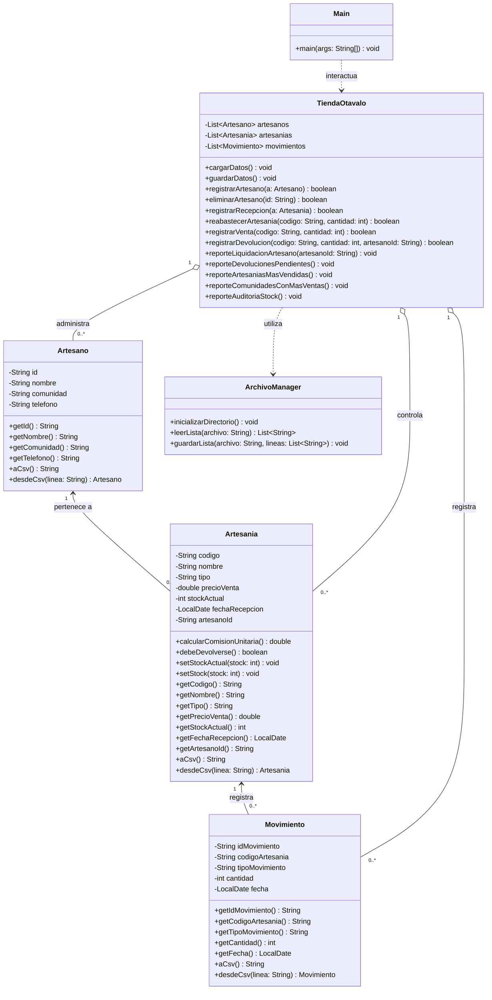

## Diagrama de Clases

```mermaid
classDiagram
    direction TB

    class TiendaOtavalo {
        -List~Artesano~ artesanos
        -List~Artesania~ artesanias
        -List~Movimiento~ movimientos
        +cargarDatos() void
        +guardarDatos() void
        +registrarArtesano(a: Artesano) boolean
        +eliminarArtesano(id: String) boolean
        +registrarRecepcion(a: Artesania) boolean
        +reabastecerArtesania(codigo: String, cantidad: int) boolean
        +registrarVenta(codigo: String, cantidad: int) boolean
        +registrarDevolucion(codigo: String, cantidad: int, artesanoId: String) boolean
        +reporteLiquidacionArtesano(artesanoId: String) void
        +reporteDevolucionesPendientes() void
        +reporteArtesaniasMasVendidas() void
        +reporteComunidadesConMasVentas() void
        +reporteAuditoriaStock() void
    }

    class Artesano {
        -String id
        -String nombre
        -String comunidad
        -String telefono
        +getId() String
        +getNombre() String
        +getComunidad() String
        +getTelefono() String
        +aCsv() String
        +desdeCsv(linea: String) Artesano
    }

    class Artesania {
        -String codigo
        -String nombre
        -String tipo
        -double precioVenta
        -int stockActual
        -LocalDate fechaRecepcion
        -String artesanoId
        +calcularComisionUnitaria() double
        +debeDevolverse() boolean
        +setStockActual(stock: int) void
        +setStock(stock: int) void
        +getCodigo() String
        +getNombre() String
        +getTipo() String
        +getPrecioVenta() double
        +getStockActual() int
        +getFechaRecepcion() LocalDate
        +getArtesanoId() String
        +aCsv() String
        +desdeCsv(linea: String) Artesania
    }

    class Movimiento {
        -String idMovimiento
        -String codigoArtesania
        -String tipoMovimiento
        -int cantidad
        -LocalDate fecha
        +getIdMovimiento() String
        +getCodigoArtesania() String
        +getTipoMovimiento() String
        +getCantidad() int
        +getFecha() LocalDate
        +aCsv() String
        +desdeCsv(linea: String) Movimiento
    }

    class ArchivoManager {
        +inicializarDirectorio() void
        +leerLista(archivo: String) List~String~
        +guardarLista(archivo: String, lineas: List~String~) void
    }

    class Main {
        +main(args: String[]) void
    }

    Artesano "1" <-- "0..*" Artesania : pertenece a
    Artesania "1" <-- "0..*" Movimiento : registra
    TiendaOtavalo "1" o-- "0..*" Artesano : administra
    TiendaOtavalo "1" o-- "0..*" Artesania : controla
    TiendaOtavalo "1" o-- "0..*" Movimiento : registra
    TiendaOtavalo ..> ArchivoManager : utiliza
    Main ..> TiendaOtavalo : interactua
```